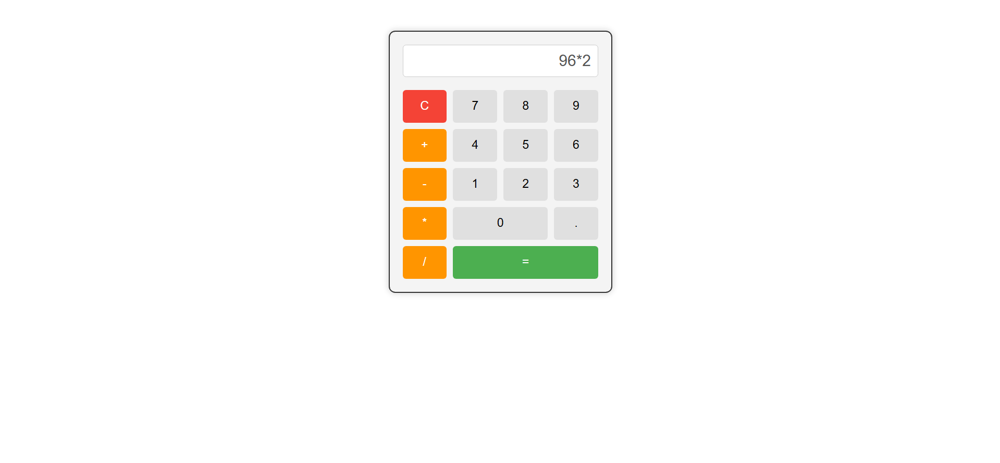

# Simple Calculator

## Overview
This is a simple web-based calculator built using **HTML, CSS, and JavaScript**. It supports basic arithmetic operations like **addition, subtraction, multiplication, and division**. The calculator provides a **dynamic display** for user inputs and operations.



---

## Features
- **Number and Operator Buttons**: Users can input numbers and perform arithmetic operations.
- **Dynamic Display**: The display updates as users input values.
- **Clear Functionality**: A "C" button resets the display.
- **Styled UI**: Simple and clean design with smooth interactions.

---

## Files Included
1. **index.html** - Defines the structure of the calculator.
2. **styles.css** - Styles the calculator with a clean UI.
3. **script.js** - Handles user input and calculations.

---

## How It Works (JavaScript Logic)

### 1. Capturing Input:
The `appendValue(value)` function appends the clicked number or operator to the display.
```js
function appendValue(value) {
    display.value += value;
}
```

### 2. Performing Calculation:
The `calculateResult()` function evaluates the entered mathematical expression.
```js
function calculateResult() {
    try {
        display.value = eval(display.value);
    } catch (error) {
        display.value = "Error"; // Handles invalid inputs
    }
}
```

### 3. Clearing Display:
The `clearDisplay()` function resets the input field.
```js
function clearDisplay() {
    display.value = "";
}
```

---

## How to Use
1. Open `index.html` in a browser.
2. Click number buttons to input values.
3. Click an operator (`+`, `-`, `*`, `/`) to choose an operation.
4. Press `=` to calculate the result.
5. Press `C` to clear the display.

---

## Author
Developed by **[K S Muckesh](https://github.com/Muckesh)**. 🚀

---
