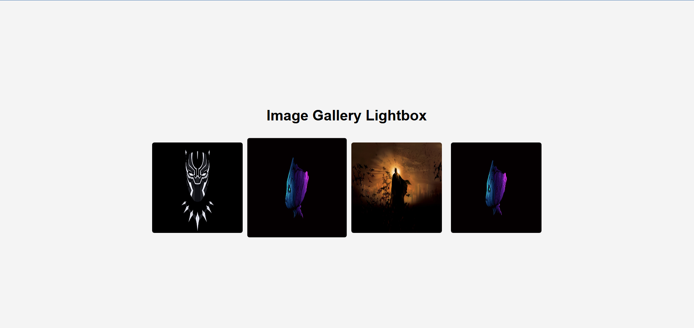

# Image Gallery Lightbox

## Overview
This is a simple **image gallery** that features a **lightbox** effect when clicking on a thumbnail. The selected image expands in a modal overlay with a smooth transition effect.


(gallery2.png)

---

## Features
- **Thumbnail Click Interaction**: Clicking on a thumbnail opens a larger version of the image.
- **Lightbox Modal Effect**: Images are displayed in a full-screen overlay with smooth transitions.
- **CSS Animations**: Hover effects on thumbnails and smooth scaling effects for the lightbox.
- **Close Button (`×`)**: Easily close the lightbox by clicking the close button.
- **Responsive Design**: Works well on various screen sizes.

---

## Files Included
1. **index.html** - Defines the gallery structure and modal.
2. **styles.css** - Styles the gallery and adds transition effects.
3. **script.js** - Handles lightbox opening and closing.

---

## JavaScript Logic

### 1. Opening the Lightbox:
The `openLightbox(imageUrl)` function updates the modal with the selected image and displays it.
```js
function openLightbox(imageUrl) {
    let lightbox = document.getElementById("lightbox");
    let lightboxImg = document.getElementById("lightbox-img");

    lightboxImg.src = imageUrl;
    lightbox.classList.add("show");  // Add class to show modal
}
```

### 2. Closing the Lightbox:
The `closeLightbox()` function hides the modal overlay.
```js
function closeLightbox() {
    let lightbox = document.getElementById("lightbox");
    lightbox.classList.remove("show");  // Remove class to hide modal
}
```

---

## How to Use
1. Open `index.html` in a browser.
2. Click on any thumbnail to open a larger version.
3. Click the **close (`×`) button** or outside the image to exit the lightbox.

---


## Author
Developed by **[K S Muckesh](https://github.com/Muckesh)**.
---